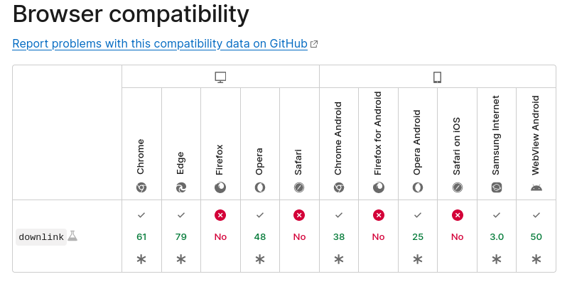

# Internet speed test 

This project is day #8 of <a href="https://github.com/grigoryan-m/31-javascript-projects.git">31-javascript-projects</a>! 

Using <i>navigator.connection.downlink</i>, which is not very accurate.
Also, it works not in all browsers:
  

